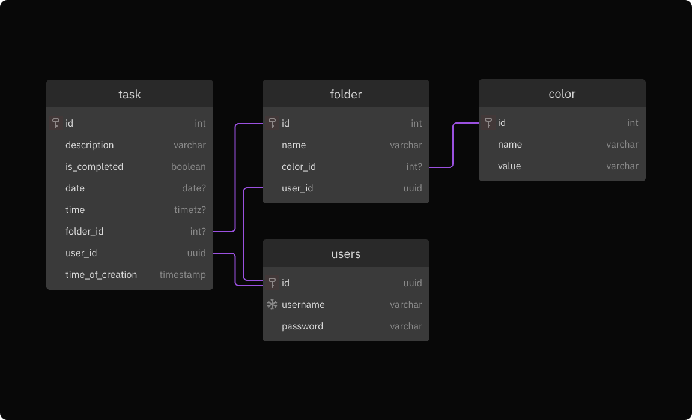

# Tasklist
[→ Deployed project on heroku](srgprp-tasklist.herokuapp.com/)


## Features

- Adding, deleting and editing task
- Setting date and time for a task
- Setting project for a task
- Adding, deleting and editing project
- Setting name and color of a project
- Login and signup

## Data design
I've choosen postgreSQl since I worked with this database before end I needed relational database to connect tasks with projects and users.



### Folder table

- Folder is a customizable collection of tasks. 
- Folders are called projects in frontend only for the user convenience.

### Color table

- Contains collection of colors, which user can assign to a project (folder).
- Initialy it had 2 additional colums with color-values. But after redesign they became deprecated.
- User is allowed to select color for a project but not to add new colors or remove any, since they are a part of UI design. 

### Users table

- Contains usernames and hashed passwords of registered users.
- User-sessions are stored separately in MongoDB.

### Task table

- Contains tasks with description, date and time and status of completion. Requied to be connected to a user, and can be assigned to a folder.
- Initially instead of <code>date: date</code> and <code>time: time</code> were <code>date: timestamp</code> and <code>has_time: boolean </code>. <code>Date</code> stored information about both date and time and <code>has_time</code> indicated whether client should read hours and minutes of <code>date</code> or not. Such entries were hard to understand (by human). And since postgres has special types for days and hours anyway, it was decided to use such instead. Though it requied some tweaks of node-postgress configuration to force it to work smoothly.
- <code>time_of_creation</code> is used only for task sorting.
- Originally table also had <code>last_time_was_updated</code> column but it was deprecated, since no use was found for it.

## API

### Tasks

<details>
    <summary>
        <code>GET</code> /tasks
    </summary>

#### Request example
```javascript
GET "https://srgprp-tasklist.herokuapp.com/tasks"
```
#### Response example
```javascript
200 OK
[
  {
    "id": 154,
    "description": "Add new task",
    "is_completed": false,
    "time_of_creation": "2022-03-03T18:34:43.534Z",
    "date": null,
    "time": null,
    "folder_name": null,
    "folder_id": null
  },
  {
    "id": 153,
    "description": "Set date and time",
    "is_completed": false,
    "time_of_creation": "2022-03-03T18:34:43.531Z",
    "date": "2022-03-03",
    "time": "18:00:00+01:00",
    "folder_name": "Casual",
    "folder_id": 23
  },
  {
    "id": 152,
    "description": "Create new project",
    "is_completed": false,
    "time_of_creation": "2022-03-03T18:34:43.526Z",
    "date": null,
    "time": null,
    "folder_name": null,
    "folder_id": null
  }
]
```
</details>

<details>
    <summary>
        <code>POST</code> /tasks
    </summary>

#### Request example
```javascript
POST "https://srgprp-tasklist.herokuapp.com/tasks"
{
    "description": "Cook pasta",
    "date": "2022-08-17",
    "time": "16:00",
    "folder_id": 1
}
```

#### Response example
```javascript
200 OK
{
    "messageToUser": "New task was created"
}
```
</details>

<details>
    <summary>
        <code>PUT</code> /tasks/:id
    </summary>

#### Request example

```javascript
PUT "https://srgprp-tasklist.herokuapp.com/tasks/110"
{
    "description": "To the dentist",
    "date": "2022-02-11",
    "time": "14:00",
    "folder_id": 1
}
```

#### Response example

```javascript
200 OK
{
    "messageToUser": "Task was successfully updated!"
}
```
</details>


<details>
    <summary>
        <code>DELETE</code> /tasks
    </summary>

#### Request example

```javascript    
DELETE "https://srgprp-tasklist.herokuapp.com/tasks/120"
```

#### Response example

```javascript
200 OK
{
    "messageToUser": "Task was successfully deleted!"
}
```
</details>


### Colors
<details>
    <summary>
        <code>GET</code>/colors
    </summary>


#### Request example
```javascript
GET "https://srgprp-tasklist.herokuapp.com/colors"
```

#### Response example
```javascript
200 OK
[
  {
    "id": 1,
    "name": "Orange",
    "value": "#FF9749"
  },
  {
    "id": 2,
    "name": "Blue",
    "value": "#3D77F6"
  },
  {
    "id": 3,
    "name": "Green",
    "value": "#169446"
  },
  {
    "id": 4,
    "name": "Berry Red",
    "value": "#BC245D"
  }
]
```
</details>

### Folders

<details>
    <summary>
        <code>GET</code> /folders
    </summary>

#### Request example

```javascript
GET "https://srgprp-tasklist.herokuapp.com/folders"
```

#### Response example

```javascript
200 OK
[
  {
    "id": 231,
    "name": "Classic Music",
    "color_id": 1
  },
  {
    "id": 8,
    "name": "Piano",
    "color_id": 2
  }
]

```
</details>

<details>
    <summary>
        <code>POST</code> /folders
    </summary>

#### Request example

```javascript
POST "https://srgprp-tasklist.herokuapp.com/folders"
{
    "folderName": "Writing",
    "colorId": "1"
}
```

#### Response example

```javascript
200 OK
{
  "folderId": 283
}
```
</details>

<details>
    <summary>
        <code>PUT</code> /folders/:id
    </summary>

#### Request example

```javascript
PUT "https://srgprp-tasklist.herokuapp.com/folders/240"
{
    "folderName": "Writing a book",
    "colorId": "283"
}
```

#### Response example

```javascript
200 OK
{
    "messageToUser": "Project has been updated"
}
```
</details>

<details>
    <summary>
        <code>DETELE</code> /folders/:id
    </summary>

#### Request example

```javascript
DELETE "https://srgprp-tasklist.herokuapp.com/folders/283"
```

#### Response example

```javascript
200 OK
{
    "messageToUser": "Folder has been deleted"
}
```
</details>

### Authentication


<details>
    <summary>
        <code>POST</code> /auth/register
    </summary>

#### Request example
```javascript
POST "https://srgprp-tasklist.herokuapp.com/auth/register"
{
    "username": "JoanOfArc",
    "password": "JoanTheFighter17@#"
}
```

#### Response example
```javascript
200 OK
{
  "isAuthenticated": true
}
```
</details>

<details>
    <summary>
        <code>POST</code> /auth/login
    </summary>

#### Request example

```javascript
POST "https://srgprp-tasklist.herokuapp.com/auth/login"
{
    "username": "JoanOfArc",
    "password": "JoanTheFighter17@#"
}
```
#### Response example

```javascript
200 OK
{
  "isAuthenticated": true
}
```
</details>

<details>
    <summary>
        <code>GET</code> /auth/logout
    </summary>

#### Request exmaple

```javascript
GET "https://srgprp-tasklist.herokuapp.com/auth/logout"
```

#### Response example

```javascript
200 OK
{
  "isAuthenticated": false
}
```

</details>

<details>
    <summary>
        <code>GET</code> /auth/check-auth
    </summary>

#### Request example

```javascript
GET "https://srgprp-tasklist.herokuapp.com/auth/check-auth"
```

#### Response example
```javascript
200 OK
{
  "isAuthenticated": false
}
```

</details>

### Users

<details>
    <summary>
        <code>POST</code> /users
    </summary>

#### Request example

```javascript
POST "https://srgprp-tasklist.herokuapp.com/users"
{
    "username": "bob"
}
```

#### Response example

```javascript
200 OK
{
  "isUsernameExists": false
}
```
</details>

## Secutiry

- Two databases
- Sessions over tokens
- Usernames instead of emails
- Hashing passwords
- Discoraging use of common passwords
- Preventing DOS attacks

### Usernames instead of emails

