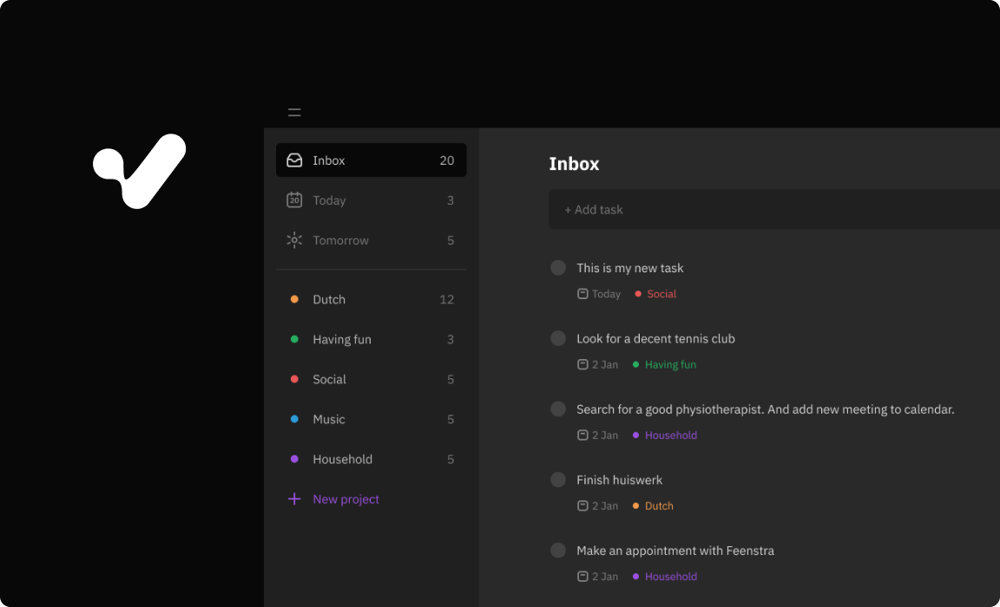

# Tasklist

Node.js express todo-list app. Portfolio project.

- Deployed project: https://srgprp-tasklist.herokuapp.com
- Follow [setup guide](./setup/setup-guide.md) to try and test Tasklist in your local machine



## Features

- Adding, deleting and editing task
- Setting date and time for a task
- Setting project for a task
- Adding, deleting and editing project
- Setting name and color of a project
- Login and signup

> Video demo soon

## Data design

All data stored in postgreSQL database.


## API
### Tasks

<details>
    <summary>
        <code>GET</code> /tasks
    </summary>

#### Request example
```javascript
GET "https://srgprp-tasklist.herokuapp.com/tasks"
```
#### Response example
```javascript
200 OK
[
  {
    "id": 154,
    "description": "Add new task",
    "is_completed": false,
    "time_of_creation": "2022-03-03T18:34:43.534Z",
    "date": null,
    "time": null,
    "folder_name": null,
    "folder_id": null
  },
  {
    "id": 153,
    "description": "Set date and time",
    "is_completed": false,
    "time_of_creation": "2022-03-03T18:34:43.531Z",
    "date": "2022-03-03",
    "time": "18:00:00+01:00",
    "folder_name": "Casual",
    "folder_id": 23
  },
  {
    "id": 152,
    "description": "Create new project",
    "is_completed": false,
    "time_of_creation": "2022-03-03T18:34:43.526Z",
    "date": null,
    "time": null,
    "folder_name": null,
    "folder_id": null
  }
]
```
</details>

<details>
    <summary>
        <code>POST</code> /tasks
    </summary>

#### Request example
```javascript
POST "https://srgprp-tasklist.herokuapp.com/tasks"
{
    "description": "Cook pasta",
    "date": "2022-08-17",
    "time": "16:00",
    "folder_id": 1
}
```

#### Response example
```javascript
200 OK
{
    "messageToUser": "New task has been created"
}
```
</details>

<details>
    <summary>
        <code>PUT</code> /tasks/:id
    </summary>

#### Request example

```javascript
PUT "https://srgprp-tasklist.herokuapp.com/tasks/110"
{
    "description": "To the dentist",
    "date": "2022-02-11",
    "time": "14:00",
    "folder_id": 1
}
```

#### Response example

```javascript
200 OK
{
    "messageToUser": "Task has been successfully updated!"
}
```
</details>


<details>
    <summary>
        <code>DELETE</code> /tasks
    </summary>

#### Request example

```javascript    
DELETE "https://srgprp-tasklist.herokuapp.com/tasks/120"
```

#### Response example

```javascript
200 OK
{
    "messageToUser": "Task has been successfully deleted!"
}
```
</details>


### Colors
<details>
    <summary>
        <code>GET</code>/colors
    </summary>


#### Request example
```javascript
GET "https://srgprp-tasklist.herokuapp.com/colors"
```

#### Response example
```javascript
200 OK
[
  {
    "id": 1,
    "name": "Orange",
    "value": "#FF9749"
  },
  {
    "id": 2,
    "name": "Blue",
    "value": "#3D77F6"
  },
  {
    "id": 3,
    "name": "Green",
    "value": "#169446"
  },
  {
    "id": 4,
    "name": "Berry Red",
    "value": "#BC245D"
  }
]
```
</details>

### Folders

<details>
    <summary>
        <code>GET</code> /folders
    </summary>

#### Request example

```javascript
GET "https://srgprp-tasklist.herokuapp.com/folders"
```

#### Response example

```javascript
200 OK
[
  {
    "id": 231,
    "name": "Classic Music",
    "color_id": 1
  },
  {
    "id": 8,
    "name": "Piano",
    "color_id": 2
  }
]

```
</details>

<details>
    <summary>
        <code>POST</code> /folders
    </summary>

#### Request example

```javascript
POST "https://srgprp-tasklist.herokuapp.com/folders"
{
    "folderName": "Writing",
    "colorId": "1"
}
```

#### Response example

```javascript
200 OK
{
  "folderId": 283
}
```
</details>

<details>
    <summary>
        <code>PUT</code> /folders/:id
    </summary>

#### Request example

```javascript
PUT "https://srgprp-tasklist.herokuapp.com/folders/240"
{
    "folderName": "Writing a book",
    "colorId": "283"
}
```

#### Response example

```javascript
200 OK
{
    "messageToUser": "Project has been updated"
}
```
</details>

<details>
    <summary>
        <code>DELETE</code> /folders/:id
    </summary>

#### Request example

```javascript
DELETE "https://srgprp-tasklist.herokuapp.com/folders/283"
```

#### Response example

```javascript
200 OK
{
    "messageToUser": "Folder has been deleted"
}
```
</details>

### Authentication


<details>
    <summary>
        <code>POST</code> /auth/register
    </summary>

#### Request example
```javascript
POST "https://srgprp-tasklist.herokuapp.com/auth/register"
{
    "username": "JoanOfArc",
    "password": "JoanTheFighter17@#"
}
```

#### Response example
```javascript
200 OK
{
  "isAuthenticated": true
}
```
</details>

<details>
    <summary>
        <code>POST</code> /auth/login
    </summary>

#### Request example

```javascript
POST "https://srgprp-tasklist.herokuapp.com/auth/login"
{
    "username": "JoanOfArc",
    "password": "JoanTheFighter17@#"
}
```
#### Response example

```javascript
200 OK
{
  "isAuthenticated": true
}
```
</details>

<details>
    <summary>
        <code>GET</code> /auth/logout
    </summary>

#### Request example

```javascript
GET "https://srgprp-tasklist.herokuapp.com/auth/logout"
```

#### Response example

```javascript
200 OK
{
  "isAuthenticated": false
}
```

</details>

<details>
    <summary>
        <code>GET</code> /auth/check-auth
    </summary>

#### Request example

```javascript
GET "https://srgprp-tasklist.herokuapp.com/auth/check-auth"
```

#### Response example
```javascript
200 OK
{
  "isAuthenticated": false
}
```

</details>

### Users

<details>
    <summary>
        <code>POST</code> /users
    </summary>

#### Request example

```javascript
POST "https://srgprp-tasklist.herokuapp.com/users"
{
    "username": "bob"
}
```

#### Response example

```javascript
200 OK
{
  "isUsernameExists": false
}
```
</details>

## Security

### Usernames instead of emails

The app utilizes usernames instead of emails for authentication so that user is able to proceed with the app without worrying about possible misuse of their personal information.

### Hashing passwords

The app doesn't store passwords in their original form. Each password goes through hashing with [bcrypt.js](https://github.com/dcodeIO/bcrypt.js) before entering database.
### Strong passwords

Library [zxcvbn by dropbox](https://github.com/dropbox/zxcvbn) checks passwords on signup page. It discourages people to use common passwords and accepts only those that are at least moderate strength.

### Sessions over tokens
The app uses session-cookies to remember users and grant them access to their own collection of projects and tasks. The token-based authentication methods were also considered but they seem less secure, more bulky and shine best in server-to-server interaction.

[Express-session module](https://github.com/expressjs/session) was used to implement sessions.